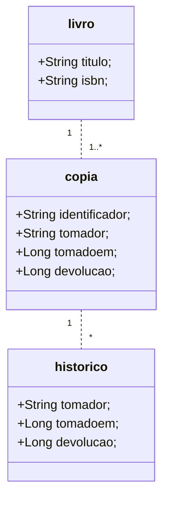

A seguir está apresentado como usar o ambiente de modelagem oferecido pelo Ycodify para o fim de criar, manter e evoluir um schema de dados para para uma aplicação qualquer. Ao final, aprenda como habilitar a execução do serviço de Backend Ycodify.

## 1. Baixar o script _yc.sh_

Você poderá acessar esse script por meio do repositório em: https://github.com/ycodify-tech/console-cli/blob/master/yc.sh

## 2. A Modelagem de _schema_ de dados de exemplo.

A título de exemplo, um pequeno modelo de dados de um sistema para empréstimos de livros é apresentado. Para tanto, suamos um diagrama de Classes da UML. Em termos simples, o schema de dados com o qual trabalharemos a partir de agora é descrito conforme o diagramado imediatamente a seguir:



| Figura 1 |

A Figura 1 apresenta três entidades, ou classes de dados: Livro, Copia e Historico. Essas entidades guardam entre si, relações de cardinalidade _1 para muitos_ (ou _\*_). Ou seja, cada instância de entidade de Historico, possui necessariamete uma instância de entidade de Copia a que deve associar-se. A respeito das instâncias de Copia, também podemos afirmar que para cada uma de suas instâncias, uma referência uma instância de Livro precisa existir. Essas classes de dados são definidas com o fim de representar um subdomínio de interesse de domínio de dados relativo a empréstimos de livros em, por exemplo, uma biblioteca.

## 3. Antes de Começar, Crie uma conta e faça o Login

Os apresentados a seguir, ajudará nessa tarefa.

## 4. Crie uma conta na plataforma Ycodify:

Use o comando 'yc create account' para criar uma nova conta de usuário na plataforma conforme a linha de comando abaixo. Nesta linha, a conta terá como nome de usuário 'ideadev', a senha dessa conta será '12345', o email de contato dessa conta será 'dev@idea.com', e a situação da conta é criada como ativa.

```shell
$ yc create account ideadev 12345 dev@idea.com
```

A resposta desse comando, em caso de sucesso, será HTTP Status Code 201. _Em caso de erro, contate o administrador do serviço_.

Uma vez que você tenha criado uma conta na plataforma YCodify, siga adiante.

## 5. Autentique-se na Plataforma Ycodify:

Use o comando 'yc login account' seguido do nome de usuário de sua conta, seguido da senha para essa conta (ver subseção **Crie uma conta na plataforma Ycodify**).

```shell
$ yc login account admidea 12345
```

Em caso de sucesso de autenticação, a mensagem que será exibida será a que informa o seu ACCESS*TOKEN. Você não precisará guardar esse tokem. O CLI saberá como recuperá-lo para usá-los nos comandos a seguir. \_Caso haja erro, procure o administrador do serviço YCodify*.

&nbsp;

## 6. Agora, ao que interessa ... à modelagem!

> **Importante**: Considerar que as instruções que seguem concernem apenas a ambientes <p style="color:red">Linux</p>

&nbsp;

### 6.1. Listar os schemas existentes associados à sua conta (_autenticada_)

Sobre conta _autenticada_ (ver subseção **... e, por fim, Autentique-se na Plataforma Ycodify**).

Para realizar o comando de listagem de seus schemas, criados até aqui, execute o comando:

```shell
$ yc read schema
```

&nbsp;

### 6.2. Criar novo schema

Aqui criaremos um schema, chamado 'biblioteca'. Abaixo o comando:

```shell
$ yc create schema biblioteca
```

O resultado da execução do comando será um HTTP Status Code 201. _Caso contrário procure o suporte do serviço_.

&nbsp;

### 6.3. Criar uma nova entidade de dados no contexto do schema 'biblioteca':

Com esse fim, execute o script 'yc create entity' seguindo o nome do schema:

```shell
$ yc create entity biblioteca livro
```

O resultado da execução do comando será um HTTP Status Code 201. _Caso contrário procure o suporte do serviço_.

&nbsp;

### 6.4. Listar todas as entidades criadas para um schema

Execute o script 'yc read-all entity' para listar todas as entidades criadas para um dado schema. Abaixo, usamos para listar todas as entidades criadas para o schema 'biblioteca'.

```shell
$ yc read-all entity biblioteca
```

O resultado da execução do comando será um HTTP Status Code 200, com a listagem de todas as entidades de dados definidas para o schema em questão. _Caso contrário procure o suporte do serviço_.

&nbsp;

### 6.5. Definir uma role específica com permissão de leitura de instância de dados de dada entidade:

O script 'yc update entity' tem por finalidade atualizar a regra de controle de acesso às instâncias de dados armazenadas pelo backend para essa entidade. No caso, em específico, as instâncias de dados da entidade 'livro', no schema 'biblioteca', poderão ser requisitadas para leitura por qualquer conta de usuário da aplicação que esteja associada ao papel 'ROLE_PUBLIC'. Os usuários que estiverem associados apenas a esse papel, não poderão realizar operações de escrita de dados relacionados a entidade 'livro'.

**Importante**: Todas as entidades de dados são criadas, por _default_ com um papel, ROLE_ADMIN. Qualquer usuário criado pela aplicação e associado a esse papel, poderá ler instância de dados do tipo dessa entidade e, também, realizar operações de escrita de dados para esse tipo de entidade --- no exemplo, 'livro'.

```shell
$ yc update entity biblioteca livro '"_rolesByAccessType":{"read":["ROLE_PUBLIC"]}'
```

&nbsp;

### 6.6. Criar um atributo chamdo 'isbn':

Para criar um atributo associando-o a uma entidade, o seguinte script precisa ser executado conforme o uso a seguir:

```shell
$ yc create attribute biblioteca livro isbn
```

Acima, o scritp 'yc create attribute'. Se esse o script for usado tal qual aparece acima, o tipo padrão para criação de atributos será considerado, ou seja, o atributo será do tipo String de tamanho 64, podendo ter o valor anulável na hora do cadastro da base de dados. Além disso, será considerado pelo backend que os valores por ventura associados a esse atributo podem ser repetidos.

Outra forma de criar attributo, de forma mais expressiva, é conforme a linha de comando a seguir:

```shell
$ yc create attribute biblioteca livro isbn '"type":"String","length":"32","isNullable":false,"isUnique":true'
```

**Importante**: Caso vc deseje criar um atributo de tipo 'String', será exigido a presença do meta-atributo 'length', na sentença acima que especifica mais detalhadamente o atributo a ser criado na entidade 'livro'.

O resultado dessas operações deve ser um HTTP Status Code igual a 201. _Em caso de erro, procure o suporte do serviço_.

&nbsp;

### 6.7. Atualizar o atributo de uma entidade:

Para atualizar um atributo de uma entidade, o seguinte script precisa ser executado conforme o uso a seguir:

```shell
$ yc update attribute biblioteca livro isbn '"isNullable":false'
```

Nesse caso, o script comandará uma atualização de restrição para persistência de instâncias de dados 'livro'. Ou seja, instâncias de dados do tipo 'livro' só poderão ser persistidas caso o atributo 'isbn' da instância esteja valorado. Caso deseje-se a atualização da restrição de unicidade no espaço de valores para instâncias de dados do tipo 'livro', para esse mesmo atributo, o scritp deve ser executado conforme:

```shell
$ yc update attribute biblioteca livro isbn '"isUnique":true'
```

Caso seu interesse seja relativo a atualizar o nome de um atributo, use o script 'yc update attribute' conforme linha abaixo (supondo que a entidade 'livro' tenha um atributo com o nome 'tite'):

```shell
$ yc create attribute biblioteca livro titulo '"name":"nome"'
```

O resultado de qualquer dos comandos acima, se ocorrerem com sucesso, deverá ser um HTTP Status Code igual a 200. _Caso contrário, procure o suporte do serviço_.

&nbsp;

### 6.8. Listar a especificação de uma entidade:

Seu interesse pode ser listar não a especficação de todas as entidades até aqui criadas, ao contrário. Apenas interessa listar a especificação de uma única entidade, por exemplo, a entidade 'livro' do schema 'biblioteca'. Para isso ocorrer, o script 'yc read entity' deve ser executado, seguida o nome do schema, seguido do nome da 'entidade'. Ver linha a seguir:

```shell
$ yc read entity biblioteca livro
```

O resultado será a exibição da especificação da entidad 'livro', do schema 'biblioteca'. O HTTP Status Code igual a 200 também será informado. _Caso contrário, procurar o suporte do serviço_.

&nbsp;

### 6.9. Criar uma nova entidade informando detalhes a respeito de controle de acesso:

Para complementos, veja o ponto 3 desta subseção. Abaixo, o script é executado sendo informado que deve ser criada uma entidade chamada 'copia' que possui uma regra de controle de acesso que diz que usuários associados ao papel 'ROLE_PUBLIC' poderão requisitar acesso de leitura às instâncias de dados do tipo 'copia'.

```shell
$ yc create entity biblioteca copia '"_rolesByAccessType":{"read":["ROLE_PUBLIC"]}'
```

O resultado dessas operações deve ser um HTTP Status Code igual a 201. _Em caso de erro, procure o suporte do serviço_.

&nbsp;

### 6.10. Criar novo atributo:

A seguir o script 'yc create attribute' cria um atributo de nome 'copiaid', de tipo String de comprimento (campo length) 64, sem que instâncias desse tipo de entidade possam ter valores vazios para esse atribudo (copiaid). Além disso não podem haver duas instâncias de , 'copiaid' com os mesmos valores. Para mais detalhes, ver nessa subseção o ponto 6.

```shell
$ yc create attribute biblioteca copia copiaid '"isNullable":false,"isUnique":true'
```

Abaixo, criamos outro atributo 'tomador', para a mesma entidade:

```shell
$ yc create attribute biblioteca copia tomador '"type":"String","length":"64","isNullable":true,"isUnique":false'
```

Abaixo, criamos mais outro atributo 'expireson', para a mesma entidade, com o tipo Long:

```shell
$ yc create attribute biblioteca copia devolucaoem '"type":"Long","isNullable":true,"isUnique":false'
```

O resultado dessas operações deve ser um HTTP Status Code igual a 201. _Em caso de erro, procure o suporte do serviço_.

&nbsp;

### 6.11. Criar um relacionamento entre a entidades:

No modelo apresentado na figura 1, no início desse documento, as entidades 'livro' e 'copia', relacionam-se. Entre elas existem uma relação de cardinalidade _1_ para _\*_, ou seja, para cada instância de entidade de 'copia', uma instância de entidade de 'livro' precisa existir. Em outro sentido, uma instância de dados de 'livro' pode ser referênciada por até _\*_ (n instancias) instâncias de entidade 'copia'. O script que realiza essa relação é o 'yc create relationship'. Veja na linha a seguir:

```shell
$ yc create relationship biblioteca copia livro '"type":"livro","isNullable":false,"isUnique":false'
```

O resultado dessa operação deve ser um HTTP Status Code igual a 201. _Em caso de erro, procure o suporte do serviço_.

&nbsp;

### 6.12. Criar restrição de composição de valores de atributos

A seguir, o scritp, deverá realizar o request para o backend respeitar a regra de restrição que diz que não pode haver duas instâncias com valores de 'copiaid' para a mesma instância de dados de 'livro'.

```shell
$ yc update entity biblioteca copia '"_composedKey":["livro", "copiaid"]'
```

O resultado dessa operação deve ser um HTTP Status Code igual a 201. _Em caso de erro, procure o suporte do serviço_.

&nbsp;

### 6.13. Deletar um atributo:

Caso deseje teletar um atributo presente a uma entidade, use o script 'yc delete attribute', informando em seguinda o nome do schema, o nome da entidade e, por fim, o nome do atributo a ser removido.

```shell
$ yc delete attribute biblioteca historico retorno
```

O resultado dessa operação deve ser um HTTP Status Code igual a 200. _Em caso de erro, procure o suporte do serviço_.

&nbsp;

### 6.14. Crie a conta de super usuário do backend:

Para que vc possa começar a usar a API de seu backend, necessariamente, ao final do processo de especificação de seu schema, vc deve executar esse comando, seguido do apresentado no ponto seguinte, o 15, desta mesma subseção.

Execute o scritp 'ycschema' com a flag 'caa' e o nome de seu schema.

```shell
$ yc create-admin-account schema biblioteca
```

o resultado será a exibição de um JSON em seu prompt de comando com o nome de super usuário e de sua senha. Anote essas informações

&nbsp;

### 6.15. Configure o status do schema:

Este comando é, por fim, o que habilitará uma instância de Backend Ycodify a que possa se comportar como como backend para sua aplicação, para os requests de seu frontend.

Execute o scritp 'yc enambe schema', com o nome do schema em seguinda.

```shell
$ yc enable schema biblioteca
```

Caso deseje realizar alguma atualização no modelo de dados de sua aplicação, antes será necessário desabilitá-lo:

```shell
$ yc disable schema biblioteca
```
