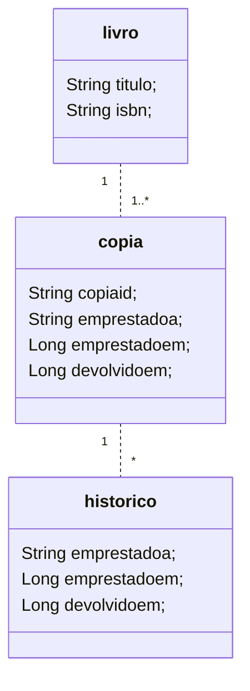

---

A linguagem YC tem por finalidade ser usada para especificação de aspectos estáticos de dados um domínio de negócios, no contexto de aplicações de software em sistemas de informação. Sua razão de ser é a preocupação central quanto ao uso integrado à plataforma YC de forma a ser a mais simples e intuitiva possível.

Este documento tem por finalidade a apresentação dessa linguagem. Essa apresentação de sua sintáxe e semântica será feita por meio de sua aplicação em exemplos de uso concretos. A seguir, primeiramente, apresentaremos suas palavras-reservadas tipos de atributos, símbolos e operadores.

Uma especificação de dados feitas com a linguagem YC deve ser empregada com a plataforma Ycodify, por meio do Console WEB (acessar em: https://api.ycodify.com/app/index.html).

## 1. Palavras Reservadas

As seguintes palavras chaves não devem fazer parte do nome de conceitos (verbos ou substantivos) empregados para descrever um domínio de negócios de uma aplicação:

- **schema**: esta palavra deve ser usada para declarar a existência de um esquema de dados, no qual toda especificação do sistema deverá estar contida.
- **entity**: palavra que deve ser usada para declarar em um _schema_ os conceitos (substantivos e verbos) que sintetizam dados em um domínio de negócios.
- **extends**: palavra reservada que deve ser usada para especificar que uma dada entidade é uma especialização de outra entidade.
- **final**: palavra reservada que deve ser usada para especificar que uma dada entidade não pode ser especializada em outra.
- **comment**: palavra reservada que deve ser usada informar comentários acerca de um objeto YC (a saber: schema, entity, attribute, relationship e account).

> As próximas palavras listadas serão definidas apenas no contexto adequado à seu uso.

- **enable**, **concurrencyControl**, **accessControl**, **read**, **write**, **persistence**, **uniqueKey**, **indexKey**, **businessRule**, **unique**, **nullable**

## 2. Tipos de Dados

A lista de tipos canônicos de dados atualmente disponíveis para tipagem de atributos em entidades é:

- **String**, **Integer**, **Long**, **Boolean**, **Double**, **Timestamp**

## 3. Símbolos e Operadores

A lista de _símbolos_ a serem usados na definição de qualquer esquema de dados, quando necessários (a vírgula é um símbolo usado para separar os itens da lista), é: **(**,**)**, **{**,**}**. O _operador_ usado aqui é o **!** (operador de negação).

## 4. Utilização e Exemplos

> _Importante_: Cada _token_ (token implica um símbolo, operador, palavra-reservada) expresso por meio dessa linguagem será compreendido como existindo _entre espaços em branco_ ou _quebras de linha_.

Antes de seguir, destacamos que tomamos para os exemplos apresentados um pequeno _domínio de dados de negócios_ como o de uma _biblioteca_. A seguir, na Figura 1, está apresentado em um Diagrama de Classes da UML os conceitos de domínio e os relacionamentos entre esses conceitos.



<p align="center">|Figura 1|</p>

O Diagrama de Classes da UML representado na figura 1 pode ser escrito com YC da seguinte forma:

```java
 1.  schema biblioteca {
 2.    entity livro {
 3.      titulo
 4.      isbn
 5.    }
 6.    entity copia {
 7.      copiaid
 8.      livro (
 9.        livro
10.      )
11.      emprestadoa
12.      emprestadoem
13.      devolvidoem
14.    }
15.    entity historico {
16.      copia (
17.        copia
18.      )
19.      emprestadoa
20.      emprestadoem (
21.        Long
22.      )
23.      devolvidoem (
24.        Long
25.      )
26.    }
27.  }
```

<p align="center">|Código 1|</p>

A forma da escrita acima, presente em Código 1, é uma escrita pobre que se baseia no uso de valores/instruções padrão para configuração do serviço de backend da plataforma para uma aplicação de software. Em termos de expressividade, podemos ter esse schema em Código 1 enriquecido, conforme a representação em Código 2.

### 4.1. Declaração de _schema_, _entity_ e atributos

Pelo que está posto em Código 1 e Código 2, a palavra reservada **schema** deve abrir a declaração da especificação dos conceitos de dados no documento (linha 1, em ambos os casos). O nome que a segue é o nome que deve ser dada à especificação como um todo. Sob a declaração **schema** devem ser definidadas todas as entidades, ou conceitos do domínio de dados de uma aplicação. Cada entidade, ao ser definida, precisa ser prefixada com a palavra reservada **entity** (linhas 2, 6 e 15 em Código 1). O que segue à palavra **entity** é o nome da entidade propriamente dito.

As entidades, por sua vez, além de serem definidas por seus nomes, carregam sob sua declaração a _especificação de atributos_ (por exemplo, os declarados nas linhas 3, 4 e 8 em Código 1).

> _Importante_: distinto da definição de entidade e esquema, a definição do nome de atributo dispensa a utilização de qualquer palavra reservada precedendo-o.

Por padrão, ou seja, se uma dada especificação não carrega explicitamente a situação do **schema** junto à plataforma Ycodify (ver em Código 2 a linha 2), ele será considerado, quando enviada à plataforma Ycodify, inabilitado para efeito de consumo de serviços da plataforma. Existirá, portanto, apenas como uma especificação de dados pura e simplesmente, atrelado ou não à plataforma.

Assim como o objeto **schema**, o objeto **entity** também define valores/instruções padrão para o instante de _deployment_ (por exemplo, ver em Código 2 as linhas 19 e 20). Mais adiante veremos mais valores/instruções associadas a uma entidade, para efeito de configuração do serviço de _backend_ a ser aplicado entidade-a-entidade.

### 4.2. Declaração de tipo de atributos em entidades

Todo atributo tem a ele um tipo de dados canônico associado (seja _String_, _Integer_, _Long_, _Boolean_, _Double_, _Timestamp_). Caso o tipo de dados de um atributo não seja explicitamente definido (por exemplo, ver o atributo definido na linha 16 em Código 2), este será considerado como sendo de tipo **String**, e essa com comprimento de até **64** caracteres.

Caso seja necessário uma especificação de tipo distinta do padrão, o usuário poderá definir entre parênteses o tipo de atributo (linhas 30 e 36 em Código 2, por exemplo). Caso o tipo não seja distinto, ou seja, **String**, o comprimento também pode ser ajustado apenas com a sufixação do comprimento à palavra reservada (ver linha 12 em Código 2).

```java
 1.  schema biblioteca (
 2.    !enable
 3.  ) {
 4.    entity livro {
 5.      titulo (
 6.        !nullable
 7.      )
 8.      autor (
 9.        !nullable
10.      )
11.      isbn (
12.        String 128
13.        !nullable
14.        unique
15.      )
16.      editora
17.    }
18.    entity copia (
19.      concurrencyControl
20.      persistence (
21.        uniqueKey [
22.          id, livro
23.        ]
24.      )
25.    ) {
26.      copiaid (
27.        !nullable
28.      )
29.      de (
30.        livro
31.      )
32.      emprestadoa (
33.        !nullable
34.      )
35.      emprestadoem (
36.        Long
37.        !nullable
38.      )
39.      devolvidoem (
40.        Long
41.      )
42.    }
43.    entity historico (
44.      businessRule
45.      persistence (
46.        indexKey [
47.          emprestada, emprestadoem
48.        ]
49.      )
50.    ) {
51.      copia (
52.        copia
53.      )
54.      emprestadoa (
55.        !nullable
56.      )
57.      emprestadoem (
58.        Long
59.        !nullable
60.      )
61.      devolvidoem (
62.        Long
63.        !nullable
64.      )
65.    }
66.  }
```

<p align="center">|Código 2|</p>

### 4.3. Palavra reservada: _enable_

Em Código 2, o que está envolvido entre parênteses, aberto na primeira linha, logo em seguida à definição do nome do **schema**, é a informação de que a situação desse esquema junto à plataforma Ycodify é a de que este _não_ dever ser consumido para efeito de operação dos serviços de backend da plataforma. Comumente, essa situação é desejada em casos em que deseja-se a realização de modificações na especificação de qualquer elemento do esquema de dados, ou da criação de novos elementos. Caso contrário, a declaração terá o operador **!** removido, e passará a informar demanda contrária.

Por padrão, caso não explicite-se o uso de **enabled** na definição de um **schema**, a declaração **!enabled** será tida como definida.

### 4.4. Palavra reservada: _concurrencyControl_

Em Código 2, linha 19, a palavra reservada **concurrencyControl** define que a plataforma deve tratar o acesso concorrente às instâncias de dados da entidade _copia_. Ou seja, funcionalmente falando, todo acesso que implique alteração do estado de uma dada instância de dados dessa tal entidade, _copia_, só será realizado mediante checagem de versão da instância do dado em questão. Caso as versões divirjam, a alteração não será efetuada e uma exceção serão lançada.

Por padrão, toda entidade declarada não terá essa funcionalidade a ela aplicada. Ou seja, seu valor padrão é **!concurrencyControl** (_ver detalhe operacional_).

### 4.5. Palavra reservada: _businessRule_

Em Código 2, linha 44, a palavra reservada **businessRule** está posta na entidade para definir para a plataforma Ycodify que ela deve invocar a regra de negócios (criada e enviada para a plataforma no instante do deployment do **schema**) associada à entidade (_historico_, no caso), exatamente no instante em que quaisquer das operações de persistência ou acesso às instâncias de dados da entidade sejam requisitadas à plataforma.

As regras de negócio são artefatos de código, escritos em Java ou Javascript, que contém alguma lógica necessária de ser executada, no contexto do backend, antes ou depois de alguma operação de persistência ou acesso às instâncias de dados das entidades já armazenadas (_ver detalhe operacional_).

### 4.6. Palavra reservada: _persistence_, _uniqueKey_ e _indexKey_

As linhas 20 e 44, no Código 2, aparece a palavra reservada **persistence**. Essa palavra reservada abriga sob si, o uso de duas outras palavras reservadas e, portanto, devem ser usadas de forma conjugada. Essas são as palavras reservadas sob **persistence**: **indexKey** (linha 45) e **uniqueKey** (linha 21).

A palavra reservada **uniqueKey** define a oportunidade para o analista de dados informar a necessidade de compor atributos (um ou mais) como sendo um único atributo (composto), com a implicação de que o espaço de valores a eles atribuídos deve conter sempre valores únicos. Por sua vez, **indexKey**, informa uma lista de atributos (um ou mais) que devem ser compostos no sentido de realizarem uma chave de busca com o objetivo de acelerar a busca, em casos em que a velocidade de acesso à instância de dados por eles apontada seja algo grave.

Por padrão, o **indexKey** e o **uniqueKey** não terão nenhum atributo(s) a eles associados no momento de sua definição. Ou seja, o array de atributos associados é vazio.

### 4.7. Palavra reservada: _accessControl_, _read_ e _write_

As linhas de 4 a 11, no Código 3, fica estabelecida a forma de declaração da regra de controle de acesso a instância de dados da persistidas pela plataforma Ycodify, para a entidade livro. Mais precisamente, na linha 4, aparece a palavra reservada **accessControl**. Essa palavra reservada abriga sob si, o uso de duas outras palavras reservadas e, portanto, devem ser usadas de forma conjugada. Essas são as palavras reservadas sob **accessControl**: **read** (linha 5) e **write** (linha 8).

A palavra reservada **read** define a oportunidade para o analista de dados informar, no array que a sucede, o nome dos papeis de usuários que possuem permissão para ler quaisquer instâncias de dados definidas pela entidade _livro_. Por sua vez, **write**, informa a lista de papeis de usuários que estão associados a autorização para criar ou modificar o estado das instâncias persistidas para a entidade livro.

No caso, apenas os usuários que estão associados ao papel 'ROLE*ADMIN' tem autorização, tanto para leitura das instâncias de dados, quanto para escrita ou modificação de estado das instâncias de dados persistidas referente a \_livro*. Os usuários que estejam associados ao papel 'ROLE_PUBLIC' possuem permissão de leitura de dados (e no caso, apenas!).

> **Importante**: todo nome de papel de usuário precisa estar em letras maiúsculas e inciar com 'ROLE\_'. O papel 'ROLE_ADMIN' está necessariamente já definido com as permissões para leitura e escrita de dados, ainda que não seja declarado.

```java
 1.  schema biblioteca {
 3.    entity livro (
 4.      accessControl (
 5.        read [
 6.          ROLE_PUBLIC,ROLE_ADMIN
 7.        ]
 8.        write [
 9.          ROLE_ADMIN
10.        ]
11.      )
12.    ) {
13      // declaração de atributos
14.    }
```

<p align="center">|Código 3|</p>

### 4.8. Palavra reservada: _unique_

Observe-se também que é possível informar que, na declaração de um atributo, o espaço de valores desse deve conter apenas valores únicos. Isso é feito pondo entre parênteses, imediatamente à declaração do atributo, a palavra reservada **unique** (ver linha 14 em Código 2). Esta declaração funciona tal qual uma _unique_ _constraint_ aplicada ao espaço de valores do atributo de uma relação em um banco de dados relacional.

Por padrão, caso não seja declarada essa palavra reservada como definição de atributo, vale a declaração **!unique**.

### 4.9. Palavra reservada: _nullable_

A palavra reservada **nullable**, por sua vez, deve ser usada entre parênteses na declaração de um atributo qualquer (ver Código 2, linhas 37 e 58). Seu uso informa que um tal atributo que a declare deverá aceitar como valor, se necessário, inclusive o valor nulo. Ou seja, é possível persistir intância de dados de uma dada entidade sem que haja valores associados a esse tal atributo.

Por padrão, todo atributo é considerado declarado como **nullable**.
