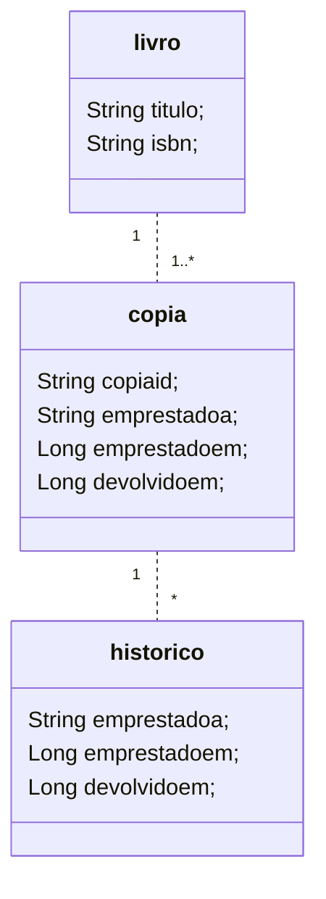

The YC language is intended to be used to specify static aspects of data in a business domain, in the context of software applications in information systems. It's raison is be the central concern regarding the use integrated to the YC platform in order to be as simple and intuitive as possible.

The purpose of this document is to present that language. This presentation of its syntax and semantics will be done through its application in concrete examples of use. Next, we will first introduce their keyword attribute types, symbols, and operators.

A data specification made with the YC language must be used with the Ycodify platform, through the WEB Console (access at: https://api.ycodify.com/app/index.html).

## 1. Reserved words

The following keywords must not be part of the name of concepts (verbs or nouns) used to describe an application's business domain:

- **schema**: this word must be used to declare the existence of a data schema, in which all system specification must be contained.
- **entity**: word that should be used to declare in a _schema_ the concepts (nouns and verbs) that synthesize data in a business domain.
- **extends**: reserved word that should be used to specify that a given entity is a specialization of another entity.
- **final**: reserved word that should be used to specify that a given entity cannot be specialized in another.
- **comment**: reserved word that should be used to inform comments about a YC object (namely: schema, entity, attribute, relationship and account).

> The next words listed will be defined only in the context appropriate to their use.

- **enable**, **concurrencyControl**, **accessControl**, **read**, **write**, **persistence**, **uniqueKey**, **indexKey**, **businessRule**, **unique**, **nullable**

## 2. Data types

The list of canonical data types currently available for typing attributes on entities is:

- **String**, **Integer**, **Long**, **Boolean**, **Double**, **Timestamp**

## 3. Symbols and Operators

The list of _symbols_ to use in defining any data schema, when needed (the comma is a symbol used to separate the items in the list), is: **(**,**)**, **{**,**}**. The _operator_ used here is the **!** (denial operator)

## 4. Usage and Examples

> _Important_: Each _token_ (token implies a symbol, operator, keyword) expressed through this language will be understood to exist _between whitespace_ or _line breaks_.

Before proceeding, we point out that for the examples presented we took a small _business data domain_ like a _library_. Next, in Figure 1, the domain concepts and the relationships between these concepts are presented in a UML Class Diagram.



<p align="center">|Figure 1|</p>

The UML Class Diagram represented in Figure 1 can be written with YC as follows:

```java
 1.  schema biblioteca {
 2.    entity livro {
 3.      titulo
 4.      isbn
 5.    }
 6.    entity copia {
 7.      copiaid
 8.      livro (
 9.        livro
10.      )
11.      emprestadoa
12.      emprestadoem
13.      devolvidoem
14.    }
15.    entity historico {
16.      copia (
17.        copia
18.      )
19.      emprestadoa
20.      emprestadoem (
21.        Long
22.      )
23.      devolvidoem (
24.        Long
25.      )
26.    }
27.  }
```

<p align="center">|Code 1|</p>

The above script, present in Code 1, is a poor script that relies on using default values/instructions for configuring the platform backend service for a software application. In terms of expressiveness, we can have this schema in Code 1 enriched, as represented in Code 2.

### 4.1. Declaration of _schema_, _entity_ and attributes

From what is stated in Code 1 and Code 2, the reserved word **schema** should open the declaration of the specification of the data concepts in the document (line 1, in both cases). The name that follows it is the name that should be given to the specification as a whole. Under the **schema** declaration, all entities or concepts of the data domain of an application must be defined. Each entity, when defined, needs to be prefixed with the reserved word **entity** (lines 2, 6 and 15 in Code 1). What follows the word **entity** is the name of the entity itself.

The entities, in turn, in addition to being defined by their names, carry under their declaration the _attribute specification_ (for example, those declared in lines 3, 4 and 8 in Code 1)

> _Important_: Unlike the entity and schema definition, the attribute name definition eliminates the use of any reserved word preceding it.

By default, that is, if a given specification does not explicitly load the status of the **schema** with the Ycodify platform (see in Code 2, line 2), it will be considered, when sent to the Ycodify platform, disabled for consumption purposes. of platform services. It will, therefore, only exist as a pure and simple data specification, tied or not to the platform.

Like the **schema** object, the **entity** object also defines default values/instructions for the _deployment_ instant (for example, see in Code 2 lines 19 and 20). Later we will see more values/instructions associated with an entity, for the purpose of configuring the _backend_ service to be applied entity-to-entity.

### 4.2. Type declaration of attributes on entities

Every attribute has a canonical data type associated with it (either _String_, _Integer_, _Long_, _Boolean_, _Double_, _Timestamp_). If the data type of an attribute is not explicitly defined (for example, see the attribute defined in line 16 in Code 2), it will be considered to be of type **String**, and this one with a length of up to **64** characters.

If a type specification other than the standard is required, the user can define the attribute type in parentheses (lines 30 and 36 in Code 2, for example). If the type is not distinct, ie **String**, the length can also be adjusted just by suffixing the length to the reserved word (see line 12 in Code 2).

```java
 1.  schema biblioteca (
 2.    !enable
 3.  ) {
 4.    entity livro {
 5.      titulo (
 6.        !nullable
 7.      )
 8.      autor (
 9.        !nullable
10.      )
11.      isbn (
12.        String 128
13.        !nullable
14.        unique
15.      )
16.      editora
17.    }
18.    entity copia (
19.      concurrencyControl
20.      persistence (
21.        uniqueKey [
22.          id, livro
23.        ]
24.      )
25.    ) {
26.      copiaid (
27.        !nullable
28.      )
29.      de (
30.        livro
31.      )
32.      emprestadoa (
33.        !nullable
34.      )
35.      emprestadoem (
36.        Long
37.        !nullable
38.      )
39.      devolvidoem (
40.        Long
41.      )
42.    }
43.    entity historico (
44.      businessRule
45.      persistence (
46.        indexKey [
47.          emprestada, emprestadoem
48.        ]
49.      )
50.    ) {
51.      copia (
52.        copia
53.      )
54.      emprestadoa (
55.        !nullable
56.      )
57.      emprestadoem (
58.        Long
59.        !nullable
60.      )
61.      devolvidoem (
62.        Long
63.        !nullable
64.      )
65.    }
66.  }
```

<p align="center">|Code 2|</p>

### 4.3. Reserved word: _enable_

In Code 2, what is involved in parentheses, open on the first line, right after the definition of the name of the **schema**, is the information that the situation of this schema with the Ycodify platform is that this _not_ must be consumed for the purpose of operating the platform's backend services. Commonly, this situation is desired in cases where it is desired to make changes to the specification of any element of the data schema, or to create new elements. Otherwise, the declaration will have the operator **!** removed, and will start to inform the opposite demand.

By default, if the use of **enabled** is not explicit in the definition of a **schema**, the **!enabled** declaration will be taken as defined.

### 4.4. Reserved word: _concurrencyControl_

In Code 2, line 19, the reserved word **concurrencyControl** defines that the platform must handle concurrent access to data instances of the _copy_ entity. In other words, functionally speaking, any access that implies changing the state of a given data instance of that entity, _copy_, will only be performed by checking the version of the data instance in question. If the versions differ, the change will not be made and an exception will be thrown.

By default, every declared entity will not have this functionality applied to it. That is, its default value is **!concurrencyControl** (_see operational detail_).

### 4.5. Reserved word: _businessRule_

In Code 2, line 44, the reserved word **businessRule** is placed in the entity to define for the Ycodify platform that it should invoke the business rule (created and sent to the platform at the time of deployment of the **schema** ) associated with the entity (_historico_, in this case), exactly when any of the persistence operations or access to the entity's data instances are requested to the platform.

Business rules are code artifacts, written in Java or Javascript, which contain some logic necessary to be executed, in the context of the backend, before or after some persistence operation or access to data instances of the entities already stored (_see detail operational_).

### 4.6. Reserved word: _persistence_, _uniqueKey_ e _indexKey_

Lines 20 and 44, in Code 2, contain the reserved word **persistence**. This reserved word harbors under it the use of two other reserved words and, therefore, must be used in conjunction. These are the reserved words under **persistence**: **indexKey** (line 45) and **uniqueKey** (line 21).

The keyword **uniqueKey** defines the opportunity for the data analyst to inform the need to compose attributes (one or more) as being a single attribute (composite), with the implication that the space of values ​​assigned to them must contain always unique values. In turn, **indexKey**, informs a list of attributes (one or more) that must be composed in order to perform a search key in order to speed up the search, in cases where the access speed to the instance of data pointed out by them is something serious.

By default, **indexKey** and **uniqueKey** will not have any attribute(s) associated with them at the time of their definition. That is, the array of associated attributes is empty.

### 4.7. Reserved word: _accessControl_, _read_ e _write_

Lines 4 to 11, in Code 3, establish the form of declaration of the access control rule to the data instance persisted by the Ycodify platform, for the book entity. More precisely, on line 4, the keyword **accessControl** appears. This reserved word harbors under it the use of two other reserved words and, therefore, must be used in conjunction. These are the reserved words under **accessControl**: **read** (line 5) and **write** (line 8).

The keyword **read** defines the opportunity for the data analyst to inform, in the array that follows it, the name of the user roles that are allowed to read any data instances defined by the _book_ entity. In turn, **write**, informs the list of user roles that are associated with the authorization to create or modify the state of the persisted instances for the book entity.

In this case, only users who are associated with the 'ROLE*ADMIN' role have authorization, both for reading data instances and for writing or modifying the state of persisted data instances referring to \_livro*. Users who are associated with the role 'ROLE_PUBLIC' have permission to read data (and in this case, only!).

> **Important**: Every user role name must be in capital letters and start with 'ROLE\_'. The role 'ROLE_ADMIN' is necessarily already defined with the permissions for reading and writing data, even if it is not declared.

```java
 1.  schema biblioteca {
 3.    entity livro (
 4.      accessControl (
 5.        read [
 6.          ROLE_PUBLIC,ROLE_ADMIN
 7.        ]
 8.        write [
 9.          ROLE_ADMIN
10.        ]
11.      )
12.    ) {
13      // declaração de atributos
14.    }
```

<p align="center">|Code 3|</p>

### 4.8. Reserved word: _unique_

Note also that it is possible to inform that, in the declaration of an attribute, its value space must contain only unique values. This is done by putting in parentheses, immediately after the attribute declaration, the keyword **unique** (see line 14 in Code 2). This declaration works just like a _unique_ _constraint_ applied to the attribute value space of a relation in a relational database.

By default, if this reserved word is not declared as an attribute definition, the **!unique** declaration is valid.

### 4.9. Reserved word: _nullable_

The reserved word **nullable**, in turn, must be used in parentheses in the declaration of any attribute (see Code 2, lines 37 and 58). Its use informs that such an attribute that declares it must accept as a value, if necessary, including the null value. That is, it is possible to persist data instances of a given entity without having values ​​associated with that attribute.

By default, every attribute is assumed to be declared **nullable**.
