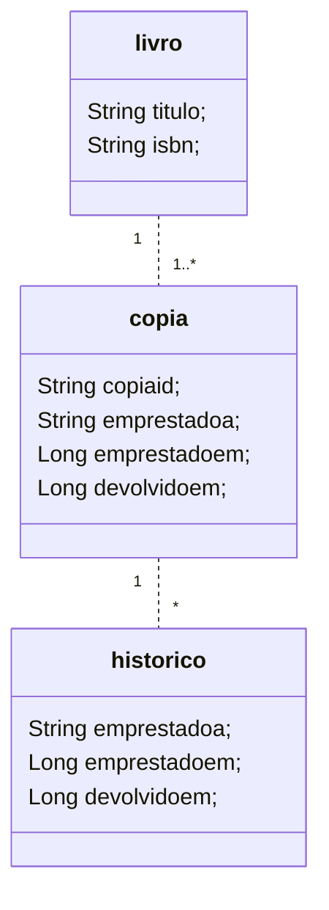

# Quickstart - Linguagem YCL.


A linguagem YC tem por finalidade ser usada para especificação de aspectos estáticos de dados um domínio de negócios, no contexto de aplicações de software em sistemas de informação. Sua razão de ser é a preocupação central quanto ao uso integrado à plataforma YC de forma a ser a mais simples e intuitiva possível. 

Este documento tem por finalidade a apresentação dessa linguagem. Essa apresentação de sua sintáxe e semântica será feita por meio de sua aplicação em exemplos de uso concretos. A seguir, primeiramente, apresentaremos suas palavras-reservadas tipos de atributos, símbolos e operadores.

Uma especificação de dados feitas com a linguagem YC deve ser empregada com a plataforma Ycodify, por meio do Console WEB (acessar em: https://api.ycodify.com/app/index.html).


## I. Palavras Reservadas

As seguintes palavras chaves não devem fazer parte do nome de conceitos (verbos ou substantivos) empregados para descrever um domínio de negócios de uma aplicação:

 - **schema**: esta palavra deve ser usada para declarar a existência de um esquema de dados, no qual toda especificação do sistema deverá estar contida.
 - **entity**: palavra que deve ser usada para declarar em um *schema* os conceitos (substantivos e verbos) que sintetizam dados em um domínio de negócios. Essa é uma entidade concreta, ou seja, faz referência a registros que podemo ser persistidos em bases de dados. 
 - **abstract**: palavra reservada que deve ser usada para declarar uma entidade como abstrata. Esse tipo de entidade, para que possa existir, só existirá como uma extensão de uma entidade concreta. 
 - **component**: palavra reservada que deve ser usada para especificar que uma dada entidade deve ser compreendida como um arranjo de dados complexo, declarado em uma relação do tipo 1 para 1 em outras entidades. 
 - **extends**: palavra reservada que deve ser usada para especificar que uma dada entidade é uma especialização de outra entidade. 
 - **enumeration**: palavra reservada que deve ser usada para especificar que uma dada entidade é deve ser encarada como um enumeration. Tal enumeration pode ser usado, portanto, como um tipo para um atributo em outra entidade, seu espaço de valores estará restrito aos valores definidos no enumeration. 
 - **final**: palavra reservada que deve ser usada para especificar que uma dada entidade não pode ser especializada por outra. 
 - **comment**: palavra reservada que deve ser usada informar comentários acerca de um objeto YC (a saber: schema, entity, attribute, relationship e account).  

> As próximas palavras listadas serão definidas apenas no contexto adequado à seu uso.

- **enable**, **concurrencyControl**,**partition**, **accessControl**, **read**, **write**, **persistence**, **uniqueKey**, **indexKey**, **businessRule**, **unique**, **nullable**


## II. Tipos de Dados

A lista de tipos canônicos de dados atualmente disponíveis para tipagem de atributos em entidades é:

- **String**, **Text**, **Integer**, **Long**, **Boolean**, **Double**, **Timestamp**


## III. Símbolos e Operadores

A lista de *símbolos* a serem usados na definição de qualquer esquema de dados, quando necessários (a vírgula é um símbolo usado para separar os itens da lista), é: **(**,**)**, **{**,**}**. O *operador* usado aqui é o **!** (operador de negação).


## IV. Utilização e Exemplos

> *Importante*: Cada *token* (token implica um símbolo, operador, palavra-reservada) expresso por meio dessa linguagem será compreendido como existindo *entre espaços em branco* ou *quebras de linha*.

Antes de seguir, destacamos que tomamos para os exemplos apresentados um pequeno *domínio de dados de negócios* como o de uma *biblioteca*. A seguir, na Figura 1, está apresentado em um Diagrama de Classes da UML os conceitos de domínio e os relacionamentos entre esses conceitos.


<p align="center">|Figura 1|</p>


O Diagrama de Classes da UML representado na figura 1 pode ser escrito com YC da seguinte forma:

```java
 1.  schema biblioteca {
 2.    entity livro {
 3.      titulo
 4.      isbn
 5.    }
 6.    entity copia {
 7.      copiaid
 8.      livro (
 9.        livro
10.      )
11.      emprestadoa
12.      emprestadoem
13.      devolvidoem 
14.    }
15.    entity historico {
16.      copia (
17.        copia
18.      )
19.      emprestadoa
20.      emprestadoem (
21.        Long
22.      )
23.      devolvidoem (
24.        Long
25.      )
26.    }
27.  }
```
<p align="center">|Código 1|</p>


A forma da escrita acima, presente em Código 1, é uma escrita pobre que se baseia no uso de valores/instruções padrão para configuração do serviço de backend da plataforma para uma aplicação de software. Em termos de expressividade, podemos ter esse _schema_ em Código 1 enriquecido, conforme a representação em Código 2.


### Declaração de _schema_, _entity_ e atributos

Pelo que está posto em Código 1 e Código 2, a palavra reservada **schema** deve abrir a declaração da especificação dos conceitos de dados no documento (linha 1, em ambos os casos). O nome que a segue é o nome que deve ser dada à especificação como um todo. Sob a declaração **schema** devem ser definidadas todas as entidades, ou conceitos do domínio de dados de uma aplicação. Cada entidade, ao ser definida, precisa ser prefixada com a palavra reservada **entity** (linhas 2, 6 e 15 em Código 1). O que segue à palavra **entity** é o nome da entidade propriamente dito.

As entidades, por sua vez, além de serem definidas por seus nomes, carregam sob sua declaração a *especificação de atributos* (por exemplo, os declarados nas linhas 3, 4 e 8 em Código 1). 

> *Importante*: distinto da definição de entidade e esquema, a definição do nome de atributo dispensa a utilização de qualquer palavra reservada precedendo-o.

Por padrão, ou seja, se uma dada especificação não carrega explicitamente a situação do **schema** junto à plataforma Ycodify (ver em Código 2 a linha 2), ele será considerado, quando enviada à plataforma Ycodify, inabilitado para efeito de consumo de serviços da plataforma. Existirá, portanto, apenas como uma especificação de dados pura e simplesmente, atrelado ou não à plataforma. 

Assim como o objeto **schema**, o objeto **entity** também define valores/instruções padrão para o instante de *deployment* (por exemplo, ver em Código 2 as linhas 19 e 20). Mais adiante veremos mais valores/instruções associadas a uma entidade, para efeito de configuração do serviço de *backend* a ser aplicado entidade-a-entidade. 


### Declaração de tipo de atributos em entidades

Todo atributo tem a ele um tipo de dados canônico associado (seja *String*, *Integer*, *Long*, *Boolean*, *Double*, *Timestamp*). Caso o tipo de dados de um atributo não seja explicitamente definido (por exemplo, ver o atributo definido na linha 16 em Código 2), este será considerado como sendo de tipo **String**, e essa com comprimento de até **64** caracteres.

Caso seja necessário uma especificação de tipo distinta do padrão, o usuário poderá definir entre parênteses o tipo de atributo (linhas 30 e 36 em Código 2, por exemplo). Caso o tipo não seja distinto, ou seja, **String**, o comprimento também pode ser ajustado apenas com a sufixação do comprimento à palavra reservada (ver linha 12 em Código 2).


```java
 1.  schema biblioteca (
 2.    !enable
 3.  ) {
 4.    entity livro {
 5.      titulo (
 6.        !nullable
 7.      )
 8.      autor (
 9.        !nullable
10.      )
11.      isbn (
12.        String 128
13.        !nullable
14.        unique
15.      )
16.      editora
17.    }
18.    entity copia (
19.      concurrencyControl
20.      uniqueKey [
21.        copiaid, livro
22.      ]
23.    ) {
24.      copiaid (
25.        !nullable
26.      )
27.      de (
28.        livro
29.      )
30.      emprestadoa (
31.        !nullable
32.      )
33.      emprestadoem (
34.        Long
35.        !nullable
36.      )
37.      devolvidoem (
38.        Long
39.      )
40.    }
41.    entity historico (
42.      sql
43.      businessRule (
44.         create (
45.           before
46.           uri:https://...
47.         )
48.         read (
49.           after
50.           uri:https://...
51.         )
52.         update (
53.           before
54.           after
56.         )
57.         delete
58.      )
59.      partition (
60.        emprestadoe
61.        ano23semestre1 [
62.          1672531200000
63.          1688169600000
64.        ]
65.        ano23semestre2 [
66.          1688169600000
67.          1698796800000
68.        ]
69.      )
70.      indexKey [
71.        emprestada, emprestadoem
72.      ]
73.    ) {
74.      copia (
75.        copia
76.      )
77.      emprestadoa (
78.        !nullable
79.      )
80.      emprestadoem (
81.        Long
82.        !nullable
83.      )
84.      devolvidoem (
85.        Long
86.        !nullable
87.      )
88.    }
89.  }
```
<p align="center">|Código 2|</p>


### Palavra reservada: _enable_

Em Código 2, o que está envolvido entre parênteses, aberto na primeira linha, logo em seguida à definição do nome do **schema**, é a informação de que a situação desse esquema junto à plataforma Ycodify é a de que este *não* dever ser consumido para efeito de operação dos serviços de backend da plataforma. Comumente, essa situação é desejada em casos em que deseja-se a realização de modificações na especificação de qualquer elemento do esquema de dados, ou da criação de novos elementos. Caso contrário, a declaração terá o operador **!** removido, e passará a informar demanda contrária. 

Por padrão, caso não explicite-se o uso de **enabled** na definição de um **schema**, a declaração **!enabled** será tida como definida.


### Palavra reservada: _concurrencyControl_

Em Código 2, linha 19, a palavra reservada **concurrencyControl** define que a plataforma deve tratar o acesso concorrente às instâncias de dados da entidade *copia*. Ou seja, funcionalmente falando, todo acesso que implique alteração do estado de uma dada instância de dados dessa tal entidade, `copia`, só será realizado mediante checagem de versão da instância do dado em questão. Caso as versões divirjam, a alteração não será efetuada e uma exceção serão lançada. 

Por padrão, toda entidade declarada não terá essa funcionalidade a ela aplicada. Ou seja, seu valor padrão é **!concurrencyControl** (*ver detalhe operacional*). 


### Palavra reservada: _businessRule_

Em Código 2, linha 43, a palavra reservada **businessRule** está posta na entidade para definir para a plataforma Ycodify que ela deve invocar a regra de negócios (criada e enviada para a plataforma no instante do _deployment_ do **schema**) associada à entidade (`historico`, no caso). A regra de execução da regra de negócio implica as declarações que especificam o tipo de operação, e o momento em que devem ser realizadas relativa mente a esse tipo de operação (_after_, _before_ ou em ambos os momentos nas cercanias da operação propriamente dita). 

As regras de negócio são artefatos de código, escritos em qualquer linguagem suportada pela [AWS Lambda Functions](https://aws.amazon.com/pt/getting-started/hands-on/run-serverless-code/), que contém alguma lógica necessária de ser executada, no contexto do backend, antes ou depois de alguma operação de persistência ou acesso às instâncias de dados das entidades já armazenadas (*ver detalhe operacional*). Siga as instruções de como criar o pacote de uma Lambda Function na AWS, em termos das interfaces que precisam ser implementadas em código, gere o pacote, conforme as instruções e suba-o na infraestrutura da AWS, ou faça o upload desse pacote em nossa própria infra-estrutura.

Caso a opção de realizar o _deploy_ dessa _lambda function_ ocorra diretamente via AWS, basta informar a URI da _function_ (fornecida pela AWS) conforme apresentado em Código 2, nas linhas 46 e 50. Caso contrário, fica dispensada essa informação, bastando apenas informar o momento em que a função deve ser executada, conforme linhas: 45, 53, 54 e 57 (o default, declara a necessidade de execução de regra de negócio e o _before_)

**IMPORTANTE**: em qualquer dos casos, chegada a hora de executar as chamadas às lambda _functions_ informadas, serão enviadas as _queries_ das requisições de persistência tal como recebidas pela interface do serviço de persistência da plataforma. Também, em qualquer dos casos, o retorno aguardado da requisição deve ser uma _query_ como outra qualquer enviada para a interface do mesmo serviço de persistência. O status code da resposta à requisição de serviço da função _lambda_, em qualquer dos casos, deverá ser 200. Em qualquer dos casos, recebido um status code com valor distinto, será gerada uma exceção na plataforma que terá precisamente o mesmo status code dessa resposta para o agente requisitor original. 


### Palavra reservada: _partition_, *uniqueKey* e *indexKey*

As linhas 42 e 74, no Código 2, apresentam três tipos de palavras chaves cujo significado é conforme informado a seguir.

**partition** é uma palavra reservada com o fim de definir uso do mecanismo de partição de dados --  de três tipos: _range_, _hash_ e _list_ -- no Código 2, linhas de 59 a 69. Seu uso é definido pela necessidade do usuário do serviço da plataforma Ycodify em particionar o espaço de dados persistidos, relativo a uma entidade, para efeitos, por exemplo, de maior eficiência em termos de busca de dados -- em circunstâncias em que a quantidade de dados armazenados cresça muito.  A estrutura geral de uso dessa palavra pode ser vista na snippet 01.

```
partition (
  <attributeNameForPartition>
  <partitinName> (
    // properties
  )
)
``` 
<p align="center">|Snippet 1|</p>

Toda partição deve ser declarada conforme o snippet 01. ` <attributeNameForPartition>` especifica precisamente o nome do atributo por meio do qual a partição se realizará -- linha 60. As linhas que vão da 59 a 69 definem a partição propriamente dita, com cada uma das partições (linhas 61 e 68) e as propriedades dessas partições entre os colchetes. 

No caso, o exemplo apresentado em Código 02, está definido um particionamento para a entidade `historico`. Esse particionamento implica que essa entidade será particionada em duas partições, `ano23semestre1` e` ano23semestre2`. Esses nomes são alusivos ao fato de que os dados serão persistidos (ou recuperados) em (ou a partir de) estruturas físicas distintas -- a entidade `historico` _não_ será uma única estrutura de base de dados como é o caso das demais entidade no _schema_ apresentado em Código 02. Esse particionamento, para ocorrer, toma por base os valores do atributo  `emprestadoem`. Ou seja, registros de `historico` serão persistidos conforme o valor do atributo `emprestadoem` -- se entre 1672531200000 e 1688169600000, `ano23semestre1`; se entre 1688169600000 e 1698796800000, `ano23semestre2`.

**IMPORTANTE**: as operações CREATE, READ, UPDATE e DELETE não precisam estar conscientes das partições. O roteamento ocorrerá internamente à plataforma de forma automática.

Por sua vez, a palavra reservada **uniqueKey** (Código 2, linha 20) define a oportunidade para o analista de dados informar a necessidade de compor atributos (um ou mais) como sendo um único atributo (composto), com a implicação de que o espaço de valores a eles atribuídos deve conter sempre valores únicos. Por sua vez, **indexKey** (Código 2, linha 72), informa uma lista de atributos (um ou mais) que devem ser compostos no sentido de realizarem uma chave de busca com o objetivo de acelerar a busca, em casos em que a velocidade de acesso à instância de dados por eles apontada seja algo grave. 


### Palavra reservada: _accessControl_, *read* e *write*

As linhas de 4 a 11, no Código 3, fica estabelecida a forma de declaração da regra de controle de acesso a instância de dados da persistidas pela plataforma Ycodify, para a entidade livro. Mais precisamente, na linha 4, aparece a palavra reservada **accessControl**. Essa palavra reservada abriga sob si, o uso de duas outras palavras reservadas e, portanto, devem ser usadas de forma conjugada. Essas são as palavras reservadas sob **accessControl**: **read** (linha 5) e **write** (linha 8). 

A palavra reservada **read** define a oportunidade para o analista de dados informar, no array que a sucede, o nome dos papeis de usuários que possuem permissão para ler quaisquer instâncias de dados definidas pela entidade *livro*. Por sua vez, **write**, informa a lista de papeis de usuários que estão associados a autorização para criar ou modificar o estado das instâncias persistidas para a entidade livro.

No caso, apenas os usuários que estão associados ao papel 'ROLE_ADMIN' tem autorização, tanto para leitura das instâncias de dados, quanto para escrita ou modificação de estado das instâncias de dados persistidas referente a *livro*. Os usuários que estejam associados ao papel 'ROLE_PUBLIC' possuem permissão de leitura de dados (e no caso, apenas!). 

> **Importante**: todo nome de papel de usuário precisa estar em letras maiúsculas e inciar com 'ROLE_'. O papel 'ROLE_ADMIN' está necessariamente já definido com as permissões para leitura e escrita de dados, ainda que não seja declarado. 

```java
 1.  schema biblioteca {
 3.    entity livro (
 4.      accessControl (
 5.        read [
 6.          ROLE_PUBLIC,ROLE_ADMIN
 7.        ]
 8.        write [
 9.          ROLE_ADMIN
10.        ]
11.      )
12.    ) {
13      // declaração de atributos
14.    }
```
<p align="center">|Código 3|</p>


### Palavra reservada: _unique_

Observe-se também que é possível informar que, na declaração de um atributo, o espaço de valores desse deve conter apenas valores únicos. Isso é feito pondo entre parênteses, imediatamente à declaração do atributo, a palavra reservada **unique** (ver linha 14 em Código 2). Esta declaração funciona tal qual uma *unique* *constraint* aplicada ao espaço de valores do atributo de uma relação em um banco de dados relacional.

Por padrão, caso não seja declarada essa palavra reservada como definição de atributo, vale a declaração **!unique**.


### Palavra reservada: _nullable_

A palavra reservada **nullable**, por sua vez, deve ser usada entre parênteses na declaração de um atributo qualquer (ver Código 2, linhas 37 e 58). Seu uso informa que um tal atributo que a declare deverá aceitar como valor, se necessário, inclusive o valor nulo. Ou seja, é possível persistir intância de dados de uma dada entidade sem que haja valores associados a esse tal atributo. 

Por padrão, todo atributo é considerado declarado como **nullable**.

